# E2E Testing Architecture

**Visual guide to the E2E testing structure for Issue #47**

---

## Test Architecture Overview

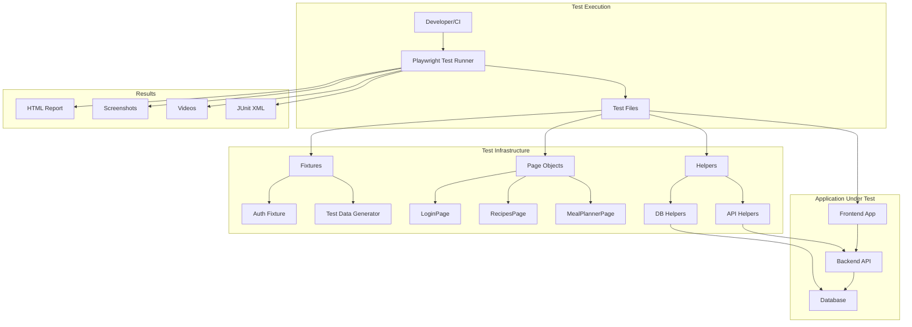

---

## Test Flow Diagram

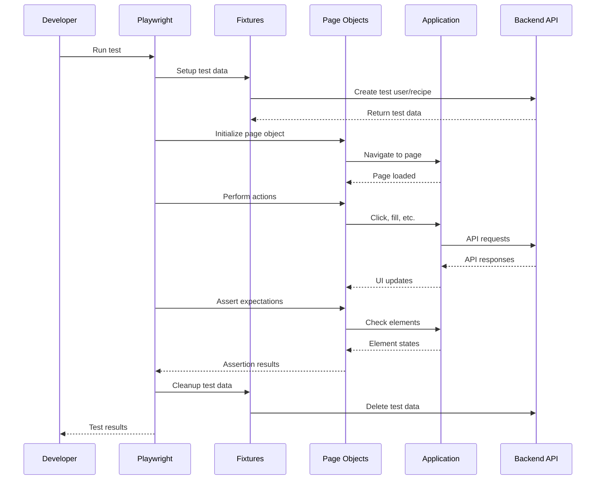

---

## File Organization

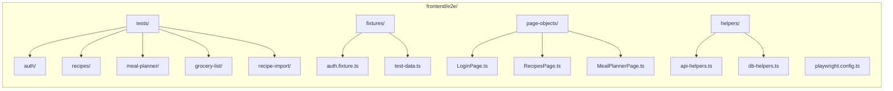

---

## Test Execution Flow

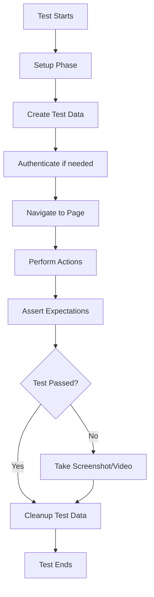

---

## Phase 1 Implementation

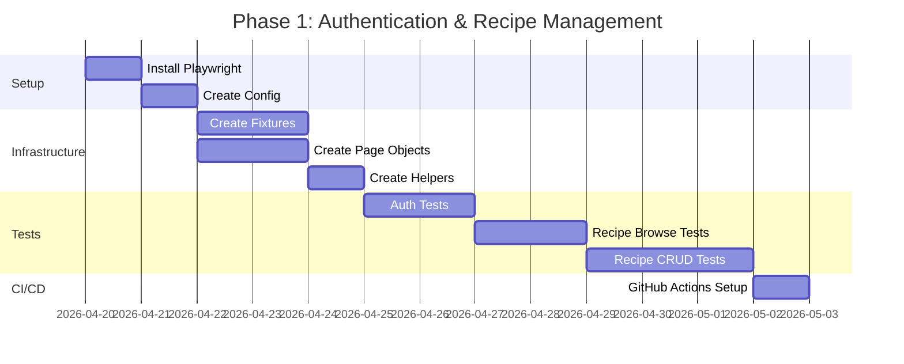

---

## Phase 2 Implementation

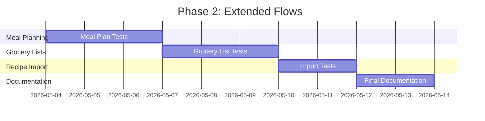

---

## Test Data Flow

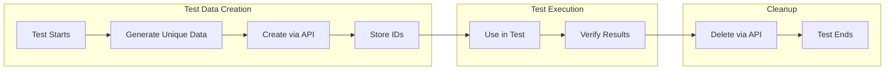

---

## Browser Testing Matrix

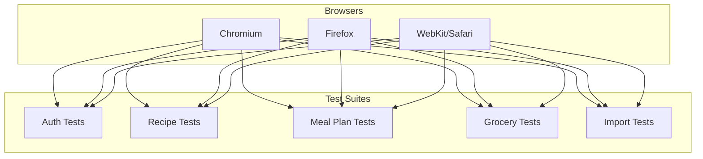

---

## CI/CD Pipeline

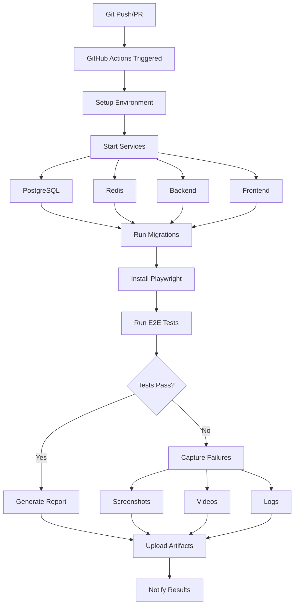

---

## Page Object Pattern

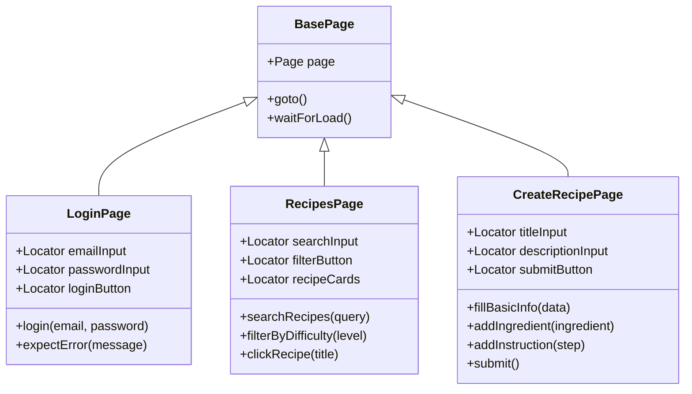

---

## Test Fixture Pattern

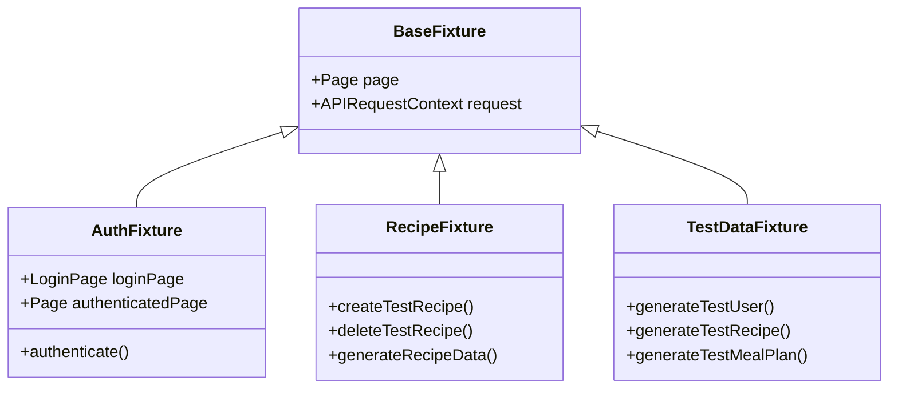

---

## Error Handling Flow

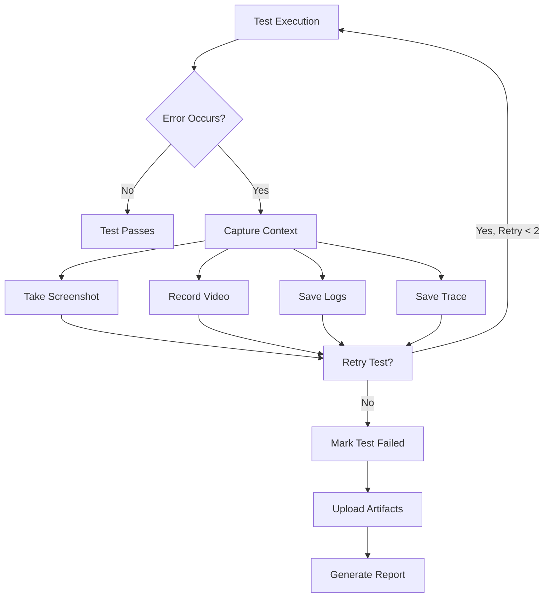

---

## Key Design Principles

### 1. Separation of Concerns
- **Tests**: Business logic and assertions
- **Page Objects**: UI interactions and selectors
- **Fixtures**: Test data and setup
- **Helpers**: Utility functions and API calls

### 2. Test Independence
- Each test creates its own data
- Tests can run in any order
- No shared state between tests
- Cleanup after each test

### 3. Maintainability
- DRY principle with page objects
- Reusable fixtures and helpers
- Clear naming conventions
- Comprehensive documentation

### 4. Reliability
- Auto-waiting for elements
- Retry logic for flaky operations
- Proper error handling
- Screenshot/video on failure

### 5. Scalability
- Parallel test execution
- Modular test structure
- Easy to add new tests
- CI/CD integration

---

## Success Metrics Dashboard

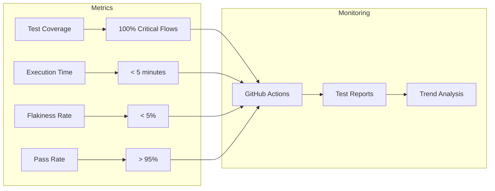

---

## Resources & References

- **Implementation Plan**: [E2E_TESTING_IMPLEMENTATION_PLAN.md](E2E_TESTING_IMPLEMENTATION_PLAN.md)
- **Quick Start Guide**: [E2E_TESTING_QUICK_START.md](E2E_TESTING_QUICK_START.md)
- **Playwright Docs**: https://playwright.dev
- **GitHub Issue**: #47

---

Made with Bob